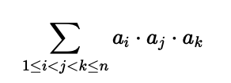

# F. Сумма тройных произведений

Задана последовательность из n чисел ai​. Найдите число:

Поскольку число может получиться слишком большим, требуется посчитать его по модулю 1 000 000 007.

## Формат ввода

В первой строке дано одно целое число n (3 ≤ n ≤ 10^6).

Во второй строке даны n целых чисел ai (0 ≤ ai ≤ 10^6).

## Формат вывода

Выведите требуемое число по модулю 1 000 000 007.

## Пример 1

### Ввод

```plain
3
1 2 3
```

### Вывод

```plain
6
```

## Пример 2

### Ввод

```plain
4
0 5 6 7
```

### Вывод

```plain
210
```
